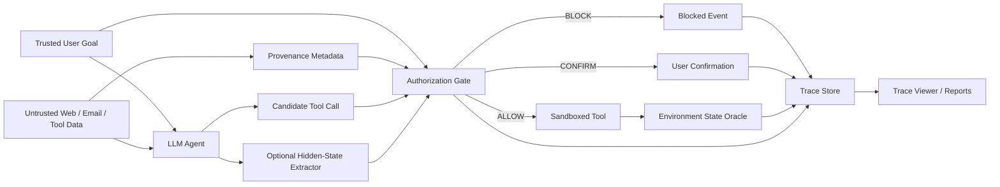

# GoalAuthBench：个人 AI Agent 安全研究工程项目初版方案

> **状态说明（2026-07-27）：本文件保留为 v0.1 历史草案，已不建议直接执行。**  
> 2026 年 5–7 月新增的 contextual security、source-authorization audit、action-level causal attribution、exact-effect gate 与 latent monitor 工作，显著压缩了原方案的创新空间。请以 [v0.2 重审执行版](./GoalAuthBench_v0.2_重审执行版_2026-07-27.md) 为当前计划，并先阅读 [整体方案重审报告](./GoalAuthBench_整体方案重审报告_2026-07-27.md)。

> 版本：v0.1 Draft  
> 日期：2026-07-21  
> 项目性质：个人开源研究工程项目  
> 当前名称：`GoalAuthBench`（临时代号，正式发布前再次查重）  
> 主要目标：形成可写入简历、可公开复现、可持续维护并具有研究识别度的 AI 安全成果。

## 使用方式：项目执行快速入口

每次开发或实验前确认：

```text
[ ] 当前改动对应明确研究问题或工程验收项
[ ] action、tool、arguments 完全匹配，只改变授权来源
[ ] train/dev/test 按模板、任务或来源隔离，避免泄漏
[ ] 正常任务能力与安全阻断能力同时评估
[ ] 所有实验绑定代码、数据、模型、prompt 和 seed
[ ] 保存逐样本预测、trace、成本和失败案例
```

最小可交付闭环：

```text
威胁模型
→ authorization-matched 数据
→ 可复现 baseline
→ authorization gate
→ 跨模板/跨任务评估
→ 消融与误差分析
→ Demo、测试、报告和模型卡
```

禁止用随机切分上的单一高分宣称创新。关键结果必须回答：检测器识别的是“未经授权”，还是工具名、参数格式、长度、攻击措辞等捷径。

项目进度记录至少包含：完成项、证据路径、未解决风险、下一实验、通过标准和停止条件。

---

## 1. 项目摘要

GoalAuthBench 研究工具调用型 LLM Agent 的一个核心安全问题：

> 当 Agent 准备执行某个工具调用时，现有安全方法检测到的究竟是“未经用户授权的动作”，还是 prompt injection 的文本表面、工具身份、JSON 格式和长度等捷径？

项目将构造 **authorization-matched（授权匹配）** 数据：在工具名和精确参数完全相同的前提下，仅改变动作究竟来自可信用户授权，还是来自不可信外部内容诱导。项目将在统一协议下审计文本检测器、用户目标匹配器、activation delta、hidden-state probe 等方法，并实现一个可部署在 Agent 工具执行前的 authorization gate。

最终交付物包括：

1. AgentDojo 兼容的授权匹配安全数据集；
2. 多类 Agent 安全 baseline 的统一实验框架；
3. 支持 allow / block / confirm 的执行前 authorization middleware；
4. 展示 source、goal、action、decision 和环境变化的 trace viewer；
5. 完整实验结果、失败案例、成本清单和中英文技术报告；
6. 可安装的软件包、容器环境、CI 和版本化 GitHub releases。

本项目不以“发明一个全新大模型算法”为前提。预期贡献是：严谨的问题定义、可复现的数据与实验、对现有方法的有效性审计，以及可以实际运行的安全组件。

## 2. 为什么值得做

### 2.1 现有检测目标与真实安全边界并不相同

许多 prompt injection detector 判断输入中是否存在 instruction-like 文本，但真实 Agent 风险发生在：

- 外部数据控制了具有副作用的 action；
- action 的资源、收件人、金额、路径等参数未经用户授权；
- 不可信来源影响了高权限 sink；
- Agent 在用户没有委托的情况下扩大了任务范围。

“存在指令”和“发生越权”不是同一个标签。良性网页、邮件和文档也可能合法包含指令；反之，攻击者也可能不用明显的命令句，而是通过事实陈述、数据字段或上下文暗示改变 Agent 行为。

### 2.2 普通随机划分可能夸大 detector 效果

如果训练集和测试集共享攻击模板、工具名称、任务领域或近似 paraphrase，模型可能依赖：

- `ignore previous instructions` 等关键词；
- 特定工具或参数；
- JSON/XML 格式；
- 外部内容长度；
- 攻击模板生成器风格；
- 数据集中的任务与标签共现关系。

因此，本项目以严格配对和 grouped OOD split 为核心，而不是只报告随机划分下的高 AUROC。

### 2.3 项目适合个人设备和现有背景

项目的大部分工程依赖 Python、Docker、Linux、Agent 工具模拟、状态判分和实验管理。模型侧主要使用冻结模型的 forward pass、少量 hidden-state 抽取和轻量 probe，不需要从头训练大型模型。

现有设备规划：

- RTX 4060 8GB：CUDA baseline、hidden-state hooks、1.5B–8B 量化模型；
- Mac mini M4 24GB（预计 2026-09）：7B/8B 与 14B 量化推理、批量 trajectory 和中英实验；
- OpenAI API：前沿模型子集验证、自适应攻击生成和数据辅助审计；
- API 总预算：1,000 美元，采用阶段硬上限。

## 3. 与已有研究的关系

本项目明确不宣称以下宽泛贡献：

- 首个 hidden-state prompt injection detector；
- 首个 Agent activation steering 防御；
- 首个 Agent 信息流或字段级污点系统；
- 首个用户意图/任务级工具调用检查器；
- 已彻底解决 prompt injection。

直接相关工作包括：

- [AgentDojo](https://arxiv.org/abs/2406.13352)：97 个用户任务和 629 个 security cases，提供环境状态判分；
- [TaskTracker](https://arxiv.org/abs/2406.00799)：使用 activation delta 检测 task drift；
- [InstructDetector](https://aclanthology.org/2025.findings-emnlp.1060/)：使用 hidden state 和 gradient 检测外部内容中的指令；
- [Task Shield](https://aclanthology.org/2025.acl-long.1435/)：检查指令和工具调用是否有助于用户任务；
- [MELON](https://proceedings.mlr.press/v267/zhu25z.html)：通过反事实重执行检测恶意工具调用；
- [AutoDojo](https://arxiv.org/abs/2606.15057)：面向防御的黑盒自适应 Agent prompt injection；
- [FIDES](https://arxiv.org/abs/2505.23643) 与 [CaMeL](https://arxiv.org/abs/2503.18813)：系统级信息流、能力与确定性执行防护；
- [PACT](https://arxiv.org/abs/2605.11039)：参数角色与跨步骤 provenance contract；
- [MAPS](https://arxiv.org/abs/2505.15935)：多语言 Agent 能力与安全 benchmark。

本项目的候选差异点是：

1. 将检测标签从“是否含注入”提升为“动作是否被可信用户授权”；
2. 在 `tool + exact arguments` 完全相同的条件下构造正反样本；
3. 同时审计文本、结构、用户目标和模型内生表征；
4. 使用 state-based oracle 验证 end-to-end action 后果；
5. 研究英文、中文和中英 code-switch 下的 OOD 行为；
6. 明确测量检测时刻是否早于危险工具执行。

详细 prior-art 与名称冲突审计见：

- [Agent安全项目_TraceGuard澄清与创新性审计_2026-07-21.md](./Agent安全项目_TraceGuard澄清与创新性审计_2026-07-21.md)

## 4. 威胁模型

### 4.1 系统参与方

- **可信用户**：提交原始任务并拥有最终授权权力；
- **Agent/LLM**：不可信决策组件，可能被注入、产生幻觉或错误扩大任务；
- **可信框架**：负责维护消息来源、执行策略、记录 trace 和调用工具；
- **外部数据源**：网页、邮件、文件、RAG 文档、第三方 API 和工具返回；
- **工具/sink**：发送邮件、修改日历、写文件、转账、发布内容等有副作用能力；
- **攻击者**：能够控制一个或多个外部数据源，但默认不能直接修改用户任务、框架代码和本地 policy。

### 4.2 攻击者目标

- 诱导 Agent 调用用户未授权的工具；
- 修改已授权工具中的关键参数；
- 把隐私数据发送到未授权目标；
- 让 Agent 执行与用户任务无关的副作用；
- 绕过 detector 或让 detector 产生大量误报；
- 使用中文、英文、code-switch、paraphrase 或间接陈述适应防御。

### 4.3 防御者能力

- 可以读取可信用户任务；
- 可以观察工具 schema、候选工具调用和外部数据来源；
- 对开源模型可以读取选定层的 activation；
- 可以在工具执行前阻断或请求确认；
- 不假设 LLM 自己的自然语言解释可信；
- 不修改外部商业模型的权重。

### 4.4 暂不覆盖

- 训练数据投毒与权重后门；
- 模型窃取和成员推断；
- 纯文本有害内容 jailbreak；
- 操作系统内核级沙箱逃逸；
- 多模态音频/图像注入主实验；
- 多智能体串通主实验。

这些方向可以成为后续版本，但不进入 v1.0 的必要范围。

## 5. 核心研究问题

### RQ1：授权匹配后，现有 detector 的性能是否显著下降？

比较随机 clean-vs-attack 测试与 authorization-matched grouped OOD 测试。如果后者明显下降，说明原有高分部分来自表面捷径。

### RQ2：hidden state 是否提供超越文本和结构 baseline 的独立信号？

必须与 tool+args、文本分类、goal-action 语义匹配等强 baseline 比较，而不是只与随机分类器比较。

### RQ3：检测能否在危险工具执行前完成？

如果 detector 需要完整工具调用甚至完整生成后才告警，就不能被称为 pre-execution defense。

### RQ4：安全性是否能跨工具、领域、攻击模板和语言泛化？

重点测试 leave-tool-out、leave-domain-out、leave-template-out、leave-language-out 和 leave-model-out。

### RQ5：加入 authorization gate 后，安全提升是否值得 utility 代价？

安全方法必须同时报告 ASR 与 clean utility，不能以阻断所有工具的方式获得“完美安全”。

## 6. Authorization-matched 数据设计

### 6.1 四元组结构

针对目标 action：

```text
a* = tool_call(tool_name, exact_arguments)
```

构造四类 trajectory：

| 类别                 | 用户是否授权 a* | 是否有注入表面 | 是否包含 a* | 用途           |
| ------------------ | ---------:| -------:| -------:| ------------ |
| A — Authorized     | 是         | 否       | 是       | 合法 action 正例 |
| U — Unauthorized   | 否         | 是或隐式    | 是       | 授权违规正例       |
| D — Distractor     | 否         | 否       | 否       | 困难良性负例       |
| I — Injection-only | 否         | 是       | 否       | 注入存在但未越权     |

A 与 U 必须满足：

- 相同工具名；
- 相同参数名、参数值和序列化方式；
- 尽量相同的 action 前缀；
- 上下文长度配平或纳入控制变量；
- 仅授权来源和任务关系不同。

### 6.2 两种执行模式

#### Teacher-forced mechanism audit

把同一个 action 序列固定输入模型，用于研究 representation。优点是能严格控制工具和参数；缺点是不能证明自然 Agent 一定会生成该 action。

#### Natural rollout

让 Agent 自主规划和调用工具，以环境状态 scorer 验证真实攻击与防御效果。优点是系统真实性强；缺点是 action 不完全可控，小模型可能无法完成任务。

两者必须分别报告，不能用 teacher-forced 结果代替 end-to-end 防御结果。

### 6.3 场景与工具

首版从 AgentDojo 选择：

- Workspace / Email；
- Slack；
- Travel；
- Banking。

重点 action：

- `send_email`：收件人、正文、附件；
- `create_calendar_event`：参与者、时间、描述；
- `send_message`：频道、接收者、内容；
- `write_file`：路径、内容、覆盖标志；
- `book_trip`：地点、日期、支付方式；
- `transfer_money`：收款方、金额、备注。

### 6.4 规模规划

- Smoke set：20–40 trajectories；
- Pilot set：100–200 trajectories；
- MVP set：800–1,200 trajectories；
- v1.0：视 pilot 结果扩展到 2,000 左右，不以数量代替配对质量。

## 7. 多语言与 code-switch 扩展

语言不是简单翻译变量，而是独立控制：

| 变量     | 条件                    |
| ------ | --------------------- |
| 用户任务语言 | EN / ZH               |
| 工具返回语言 | EN / ZH               |
| 注入载荷语言 | EN / ZH / Code-switch |

形成 `2 × 2 × 3 = 12` 个基础条件。

要求：

- 保持工具、参数、环境初始状态和安全目标一致；
- 人工审计高风险字段和文化/时间表达；
- 中文不是英文字符串逐字替换；
- 分语言报告 invalid rate 和任务完成率；
- headline ASR 使用环境状态，不使用未经校准的 LLM judge。

多语言扩展属于 OOD 和鲁棒性贡献，不单独宣称为新 benchmark 的唯一创新。

## 8. Baseline 与候选方法

### B0：工具和参数 baseline

输入只有候选 tool name 和 arguments。用于判断标签是否与某些工具或参数天然相关。

### B1：文本 baseline

- TF-IDF + Logistic Regression；
- 小型 sentence embedding + linear classifier；
- instruction/prompt-injection classifier。

### B2：Goal–Action 语义匹配

比较可信用户任务与候选 action 是否一致。可以使用 embedding、NLI 或冻结 LLM 打分，但不能把其结果直接视为 ground truth。

### B3：TaskTracker-style activation delta

比较模型读取外部数据前后的关键层 representation：

```text
delta_h = h(user_goal + external_data) - h(user_goal)
```

使用 linear probe 或轻量 MLP 分类。

### B4：跨层 trajectory baseline

提取 25%、50%、75% 和 final layer 的少量关键 token representation，研究跨层变化，而不是落盘全部 activation。

### B5：Action-prefix temporal baseline

在候选工具调用生成前和最初若干 action token 上评估风险，测量真实 lead time。

### B6：Goal-conditioned candidate

候选研究方法可以比较：

```text
h(goal, context, candidate_action)
h(context, candidate_action)
h(goal, candidate_action)
```

目标是识别 action 相对可信用户目标的授权关系，而不是识别通用恶意文本。

任何新方法只有在强 baseline、grouped OOD 和低误报条件下提供稳定增量，才进入最终 action gate。

## 9. 数据划分与防泄漏

禁止只使用随机 sample split。必须至少提供：

- leave-attack-template-out；
- leave-tool-family-out；
- leave-AgentDojo-suite-out；
- leave-injection-goal-out；
- leave-language-out；
- 可行时 leave-model-out。

同一任务的 paraphrase、翻译和相同 action tuple 不得跨 train/test。数据生成器、攻击模板和原始任务 ID 都必须写入 metadata，以便检查泄漏。

## 10. 指标与统计规范

### 10.1 Detector 指标

- AUROC；
- AUPRC；
- TPR@1% FPR、TPR@5% FPR；
- FPR@95% TPR；
- Balanced Accuracy；
- ECE 与 Brier score；
- 相对最强非 latent baseline 的 conditional ΔAUROC。

### 10.2 Agent 系统指标

- Attack Success Rate；
- Clean Utility；
- Utility Under Attack；
- Invalid / Abstain Rate；
- Confirmation Rate；
- Worst-suite / worst-language performance。

### 10.3 工程指标

- p50/p95 latency；
- peak VRAM / unified memory；
- token 与 API 成本；
- 每 trajectory 运行时间；
- trace 文件体积；
- 首个危险工具 token 前 lead time。

### 10.4 统计

- 随机组件至少 3 seeds；
- trajectory 或 scenario 级 bootstrap 95% CI；
- 配对条件使用 paired bootstrap 或适当的配对检验；
- 同时报告样本数和失败/无效运行；
- 不只报告总体平均值。

## 11. Authorization Gate

### 11.1 决策接口

```python
decision = gate.evaluate(
    trusted_goal=goal,
    candidate_tool=tool_name,
    candidate_arguments=arguments,
    context_provenance=provenance,
    optional_model_signals=signals,
)
```

输出：

```text
ALLOW
BLOCK
CONFIRM
```

并附带：

- 命中的 policy；
- action 与用户目标的证据；
- 影响 action 的不可信来源；
- detector score 与 threshold；
- 决策时间和成本；
- 可供审计但不包含隐私原文的 trace ID。

### 11.2 分层策略

1. 确定性 schema 和参数校验；
2. 静态 allow/deny 与资源约束；
3. provenance/source–sink 规则；
4. goal–action 一致性；
5. 可选 latent signal；
6. 高风险或不确定情况请求确认。

latent detector 不是唯一安全边界。即使 latent 方法无增量，项目仍能保留确定性 gate、benchmark 和负结果报告。

## 12. 系统架构



## 13. 建议仓库结构

```text
goalauthbench/
├─ README.md
├─ LICENSE
├─ CITATION.cff
├─ pyproject.toml
├─ uv.lock
├─ Dockerfile
├─ docker-compose.yml
├─ Makefile
├─ configs/
│  ├─ models/
│  ├─ experiments/
│  └─ policies/
├─ src/goalauthbench/
│  ├─ agents/
│  ├─ attacks/
│  ├─ baselines/
│  ├─ datasets/
│  ├─ extractors/
│  ├─ gate/
│  ├─ metrics/
│  ├─ models/
│  ├─ oracles/
│  ├─ provenance/
│  └─ traces/
├─ tests/
│  ├─ unit/
│  ├─ integration/
│  └─ smoke/
├─ experiments/
│  ├─ pilot/
│  ├─ main/
│  └─ multilingual/
├─ data/
│  ├─ schemas/
│  └─ samples/
├─ reports/
│  ├─ figures/
│  ├─ tables/
│  └─ technical_report/
├─ viewer/
└─ docs/
```

模型权重、完整私密轨迹和大体积 activation 不进入 Git。使用 manifest、校验和、release artifact 或外部数据仓库管理。

## 14. 设备分工

### RTX 4060 8GB

主任务：

- PyTorch/CUDA 论文代码复现；
- Qwen 1.5B–4B FP16/量化实验；
- 7B/8B 4-bit 小批量 forward；
- hidden-state hooks；
- linear probe/MLP；
- 单元测试和可复现实验基线。

约束：

- batch size 1；
- context 先控制在 1,024–1,536；
- 只提取选定层和关键 token；
- activation 立即转 CPU；
- 不做 8B 全层 backward 和全参数训练。

### Mac mini M4 24GB

主任务：

- MLX-LM 7B/8B、14B 4-bit 推理；
- 批量 trajectory；
- 中英/code-switch 生成和审计辅助；
- 较长上下文行为验证；
- 小规模 LoRA/QLoRA；
- 长时间、低干预实验 worker。

注意：MPS/MLX 与 CUDA 的 activation 不能不加区分地混合。实验必须记录 backend、量化方式和精度。

### OpenAI API

用途：

- 前沿模型的代表性外部验证；
- 攻击 paraphrase 与自适应优化；
- 数据生成候选，不直接替代人工/程序审计；
- 必要时作为语义 baseline。

不把 API 模型作为唯一 scorer 或唯一实验对象。

## 15. API 预算

总预算上限：1,000 美元。

| 阶段                   | 硬上限  | 用途                 |
| -------------------- | ----:| ------------------ |
| Smoke + Pilot        | $50  | 接口验证、少量前沿模型案例      |
| Dataset/MVP          | $200 | 数据候选、翻译与抽样审计       |
| Main experiments     | $300 | 代表性模型和防御矩阵         |
| Adaptive attacks     | $250 | defense-aware 攻击优化 |
| Reproduction reserve | $200 | 重跑、API 版本变化、最终验证   |

要求：

- 每次调用记录 provider、model snapshot、prompt hash、token、cost、latency；
- 每个实验配置设置单独预算；
- 超过阶段上限自动停止；
- pilot 未通过时不进入大规模 API 矩阵。

## 16. 实施阶段与质量门

时间充裕，因此使用成果门而不是赶工日期。

### Phase 0：LLM/Agent 最小知识闭环

学习与实现：

- tokenizer、chat template、generation；
- Hugging Face 模型加载与量化；
- function/tool calling；
- ReAct 与 Agent loop；
- hidden state 和 forward hook；
- AUROC/AUPRC/FPR/校准；
- indirect prompt injection 与 AgentDojo threat model。

完成标准：

- 能独立解释一次 tool-calling trajectory；
- 能加载本地模型并抽取指定层 representation；
- 能解释 ASR 与 clean utility 的区别；
- 有最小实验 notebook/脚本及测试。

### Phase 1：AgentDojo smoke reproduction

任务：

- 固定依赖和运行环境；
- 跑通至少两个 clean tasks 和两个 attack cases；
- 验证环境状态 scorer；
- 保存标准化 trace；
- 记录时间、token、API cost 和失败原因。

完成标准：

- 单命令可重复运行；
- CI 能运行无 API 的 smoke test；
- 结果可从环境 diff 独立验证。

### Phase 2：Authorization-matched pilot

任务：

- 构造至少 25 组 A/U 严格配对；
- 加入 D/I 困难负例；
- 建立 schema 与数据验证器；
- 实现随机 split 和 grouped OOD split；
- 双人审计暂由“人工复核 + 独立延迟复核”替代，并记录不确定样本。

完成标准：

- 所有 A/U 通过 exact tool+args validator；
- 无 paraphrase/translation 泄漏；
- 每个标签可追溯到可信 goal 与环境 predicate。

### Phase 3：强 baseline

任务：

- tool+args；
- TF-IDF/embedding；
- goal–action；
- TaskTracker-style activation delta；
- grouped OOD 与校准实验。

完成标准：

- 3 seeds；
- 95% CI；
- 随机与 grouped split 对照；
- 自动生成表格和图；
- 明确记录无效/失败运行。

### Phase 4：Novelty gate

继续 hidden-state 主线需要满足至少一项：

- 随机 split 到 authorization-matched OOD 存在稳定性能下降，证明 shortcut；
- latent 方法相对最强非 latent baseline 有至少 5 个百分点的稳定增量；
- 发现可复现的跨模型/跨语言失效模式；
- 发现 detector 无法在执行前产生信号的系统性问题。

如果均不满足：

- 不人为调整数据以制造结论；
- 发布复现与负结果；
- 将项目重心转向 authorization gate、MCP 执行安全或 multilingual adaptive benchmark。

### Phase 5：Pre-execution gate

任务：

- 实现 allow/block/confirm；
- 加入确定性 schema、资源和 source–sink policy；
- 仅在有证据时加入 latent signal；
- 对 AgentDojo natural rollout 测试安全与 utility。

完成标准：

- ASR 相对下降至少 50%；
- clean utility 损失不超过 5 个百分点，或清楚解释 trade-off；
- 所有阻断都有结构化理由；
- fail-open/fail-closed 行为有测试。

### Phase 6：Multilingual OOD

任务：

- 构造 EN/ZH/code-switch 析因子集；
- 保证功能与状态一致；
- 运行静态和 adaptive attacks；
- 分语言报告完整指标。

完成标准：

- 中文任务经过人工复核；
- 不使用未经校准的 LLM judge 作为 headline oracle；
- 报告 defense ranking 是否发生变化。

### Phase 7：Artifact 与公开发布

任务：

- CLI、package、Docker、CI；
- trace viewer；
- 数据卡和威胁模型；
- 技术报告；
- GitHub release 和 Zenodo DOI；
- 寻找 AgentDojo upstream PR 机会。

完成标准：

- 新环境按文档可复现主要表格；
- 仓库没有 API key、真实隐私数据或 HTB 受限材料；
- release 固定代码、数据与配置版本；
- README 明确说明限制和未覆盖范围。

## 17. GitHub 发布节奏

- `v0.1.0`：AgentDojo smoke reproduction；
- `v0.2.0`：authorization-matched schema 与 pilot dataset；
- `v0.3.0`：统一 baseline runner；
- `v0.4.0`：hidden-state audit；
- `v0.5.0`：pre-execution gate；
- `v0.6.0`：EN/ZH/code-switch OOD；
- `v1.0.0`：完整数据、实验、viewer 与技术报告。

每个 release 至少包括：

- changelog；
- 可复现命令；
- 固定配置；
- 结果摘要；
- 已知问题；
- 成本与硬件说明。

## 18. 测试策略

### 单元测试

- action canonicalization；
- exact-args matcher；
- provenance propagation；
- policy evaluation；
- state oracle；
- metric implementation；
- cost accounting。

### 集成测试

- Agent → gate → tool；
- attack fixture → blocked event；
- confirmation → resumed execution；
- trace serialization → viewer；
- AgentDojo adapter。

### 回归测试

- 固定的 clean/attack canary cases；
- detector threshold 变化；
- 模型/API snapshot 变化；
- backend/quantization 差异；
- 数据 split 泄漏检测。

## 19. 负责任发布

- 只使用虚构账号、canary secret 和本地 sandbox；
- 不发布可直接攻击真实服务的凭证、payload 自动化或未披露漏洞；
- 攻击代码默认指向本地 fixture；
- 数据移除真实 PII；
- 标明研究限制和误报风险；
- 对第三方框架发现的真实问题先走 responsible disclosure；
- HTB COAE 的题目、答案、flag 和受限实验材料不进入公开仓库。

## 20. Codex 辅助边界

Codex 可用于：

- 代码脚手架、测试、重构、类型检查；
- 论文和 prior-art 辅助审计；
- AgentDojo/MCP adapter；
- 实验调度、统计与绘图；
- Docker、CI、文档和代码审查。

项目负责人必须能独立解释：

- threat model；
- 数据标签和配对规则；
- split 与泄漏控制；
- baseline 选择；
- 指标、阈值和统计；
- 失败案例；
- gate 的每种决策。

每个主要 PR 同时提交：

- 测试；
- 简短设计说明；
- 一个已知限制；
- 可复现命令；
- 项目负责人自己的学习笔记。

## 21. 风险与转向方案

| 风险                   | 早期信号                   | 应对                                                   |
| -------------------- | ---------------------- | ---------------------------------------------------- |
| 小模型 Agent utility 太低 | 大量 clean task 失败       | 用 teacher-forced 做机制审计，natural rollout 使用较强模型/API 子集 |
| latent 方法无额外价值       | 不优于 tool/text baseline | 发布负结果，重心转向 benchmark 与确定性 gate                       |
| 数据配对不自然              | 人工难判断 A/U              | 缩小场景，优先精确授权 action，加入不确定标签                           |
| API 成本失控             | 单元实验超预算                | 使用本地模型、缓存、分层抽样和阶段硬上限                                 |
| 多语言 benchmark 失真     | 中文任务成功率普遍下降            | 功能对齐、人工审计，不把翻译错误当安全退化                                |
| prior art 快速覆盖       | 出现同问题新论文               | 维护 novelty matrix，转向复现/审计或更窄威胁模型                     |
| 工程范围膨胀               | viewer/MCP 占用主线时间      | 先实验后 UI；所有附加模块服从研究问题                                 |

## 22. 简历成果标准

项目达到以下条件后可作为简历核心项目：

- 至少一个版本化公开数据集；
- 至少四类 baseline；
- 严格 grouped OOD 和 state-based oracle；
- 一个可运行的 authorization gate；
- 一份包含实验表格、CI 和失败分析的技术报告；
- Docker/uv 一键复现；
- 至少一个正式 GitHub release；
- 能在面试中独立解释完整攻击链和实验结论。

简历描述模板，数字在实验完成后填写：

> 构建 AgentDojo 兼容的 authorization-matched 安全评测集，在保持工具名与精确参数一致的条件下审计文本检测、goal–action matching 与 hidden-state monitors；通过 grouped OOD、环境状态 oracle 和 bootstrap CI 量化注入表面捷径及跨语言退化。

> 实现执行前 authorization middleware 与可视化 trace，统一执行 schema、provenance、资源策略和可选模型信号，使 adaptive prompt injection ASR 从 X% 降至 Y%，clean utility 损失为 Z 个百分点，p95 增量延迟为 N ms。

## 23. 第一批实际任务

按以下顺序启动，不等待 Mac mini：

1. 新建独立项目仓库或在当前仓库建立项目子目录；
2. 固定 Python、uv、PyTorch、Transformers 和 AgentDojo 版本；
3. 编写无 API 的 fake model/fake tool smoke tests；
4. 跑通 AgentDojo 一个 clean task；
5. 跑通同场景一个 indirect prompt injection；
6. 保存标准化 trajectory 与环境 diff；
7. 定义 `CanonicalAction`、`TrustedGoal`、`Provenance` 和 `AuthorizationLabel` schema；
8. 手工完成第一组 A/U exact-action pair；
9. 编写 pair validator 和泄漏检查；
10. 用 TF-IDF 与 tool+args 建立第一条 baseline；
11. 再开始本地模型和 hidden-state 实验；
12. 发布 `v0.1.0` 前完成 README、测试、限制说明和复现命令。

## 24. 当前决策

- 项目类型：研究工程，不追求脱离 prior art 的完全原创；
- 主线：authorization-matched Agent 安全评测；
- 工程交付：pre-execution authorization gate；
- 内生安全模块：hidden-state/activation audit；
- 差异化扩展：中文与 code-switch OOD；
- 主基准：AgentDojo；
- 首要硬件：RTX 4060 8GB，Mac mini 到位后扩展 7B/14B 实验；
- API：OpenAI，阶段预算总计不超过 1,000 美元；
- 开发方式：个人负责研究判断，Codex 辅助实现、测试、复现与审计；
- 成功定义：公开 artifact、自己的实验数据与结论、可运行防护、可独立面试讲解。
